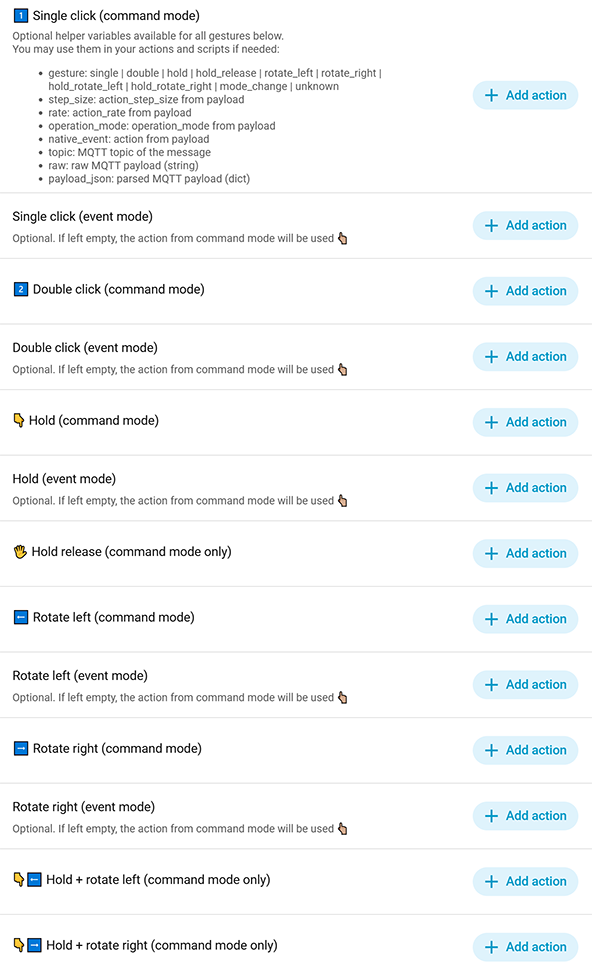
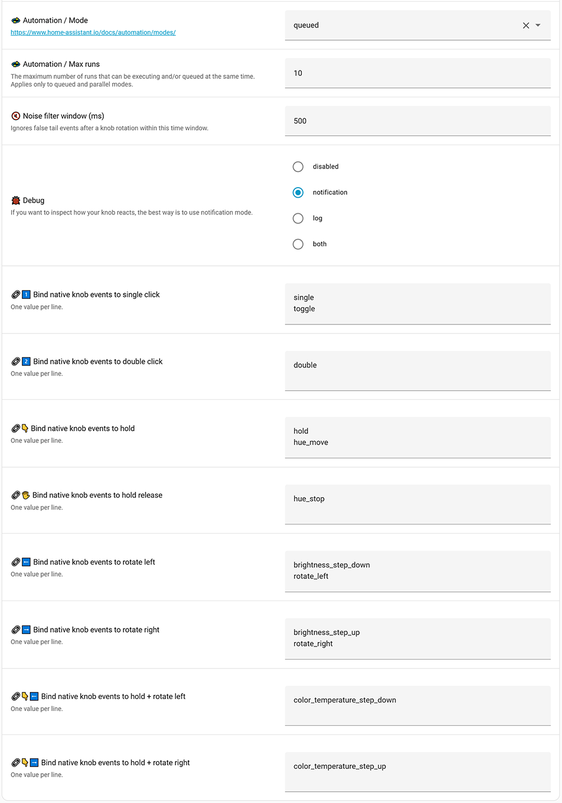
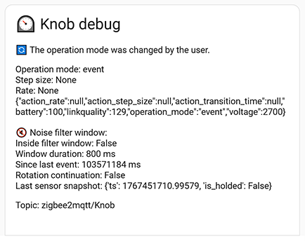

🗺️ [How to use](#%EF%B8%8F-how-to-use)  🛠 [Installation](#-installation)  🐞 [Troubleshooting](#-troubleshooting)

# ⏲️ Z2M Knob — Gesture Action Controller (Moes ZG-101ZD & similar AliExpress-sold knobs)
[](https://hacs.xyz/)
[](https://www.home-assistant.io/docs/blueprint/)
[](https://www.zigbee2mqtt.io/)
[](https://github.com/LanKing/z2m-knobs-gesture-controller/releases)
[](LICENSE)

Assign your own actions to Zigbee2MQTT rotary-knob gestures in Home Assistant. Supports Command/Event modes and includes noise filtering for false “tail” events.

## ✨ Features
- Works with many Zigbee2MQTT rotary knobs (brands such as Moes, Girier, and others — mostly AliExpress-sold models)
- Bind gestures to any HA actions or scripts, with optional helper parameters (gesture, step_size, rate, etc.)
- Supports both Command and Event operation modes (typically switched using a triple-click on most knobs)
- Noise filtering for accidental “tail” events (e.g., unwanted rotation after hold+rotate, or a single click triggered after rotation)
- Allows visual customization of native low-level event mappings if your knob uses different payload values
- Supports configuring automation mode and maximum concurrent runs
- Debug output available via notifications or logs

_**Core idea of this blueprint — assign actions to gestures instead of handling raw MQTT events.**_



## 💡 Why this blueprint is better than writing custom knob automations

Out of the box, Zigbee2MQTT rotary knobs only publish raw MQTT events.  
You *can* wire them directly into your automations — but that means:
- spending time inspecting and decoding raw MQTT payloads
- writing and maintaining custom automation logic
- duplicating the same mapping patterns across multiple automations
- mixing low-level device-handling code with your real logic (lights, scenes, etc.)
- debugging false “tail” events and edge-case behaviors

🎯 This blueprint is better because it turns raw MQTT events into clean, human-readable gestures and lets you configure all actions through the UI — with zero YAML and no custom automations. Instead of fighting payloads, you simply choose what each gesture does.

It also cleanly separates concerns:
- works as a reusable **gesture-controller layer** for any supported knob
- converts unpredictable MQTT events into consistent gestures (single, double, hold, rotate…)
- handles Command/Event modes and noise filtering automatically, in one place
- exposes a simple action interface with optional helper variables when you need more control

Your scripts stay small and focused on behavior, while the knob logic is configured once and reused everywhere.

---

## 🗺️ How to use

### 🔰 Basic usage

1. Create an automation from this blueprint in your Home Assistant:
  - Settings → Automations & Scenes → Automations → Add Automation → Use Blueprint.​
  - Select: “**Z2M Knob — Gesture Action Controller**” in the blueprint list.
2. Set the MQTT topic of your knob:
   - Open Zigbee2MQTT → Devices → choose your knob → copy its **Friendly name**.
   - Replace `your_knob_friendly_name` in the blueprint field with the copied value. _e.g.: zigbee2mqtt/Bedroom_Knob._
   - 🥳 Now the automation listens to events from this specific knob.
3. Assign your actions to gestures (what each gesture will do). 

### 🚀 Advanced usage



#### 🔇 Noise filter window
Without a noise filter, rotating while holding may produce unwanted “tail” events that can trigger actions you didn’t intend (for example, an extra single or toggle event after rotation).

The noise filter window is the period (in milliseconds) during which follow-up events after rotation are ignored.

In most cases 500 ms is good enough, but you can tune it manually. Please, [use debugger](#-debugging) to test your events and check if filter window has good size for you.

#### 🐞 Debugging
Use Debug mode to test behavior. Set Debug = `notification`. A new notification will appear in HA. Open it, rotate and click the knob, and observe how events are converted into gestures and filtered.



This helps you:
- see the **native event** coming from the device 
- verify whether an event was filtered as a “tail”  
- check the current **operation mode** (command/event)

If your knob produces different event values —  adjust them in the **gesture binding table** in the blueprint inputs.

If your knob uses a different operation-mode model — copy the debug data and send it to me, I will add support.

#### 🔗 Low level events to gestures
If your knob has other events than in blueprint ([use debugger](#-debugging) to test them), you can re-bind native knob events to gestures. Enter your event names in the right-side field (one per line).

#### 👨‍🏫 Additional parameters for scripts

If you are an advanced user and use scripts as actions, you can pass additional parameters from the automation to your script.

Below is an example of how to use this. First, create a script.

##### Creating a test script

Settings → Automations & Scenes → Scripts → Create Script → Create new script → ⋮ (menu) → Edit as YAML

Example script:

```yaml
alias: "Debug variables from Lanking blueprint"
mode: parallel
sequence:
  - action: persistent_notification.create
    data:
      title: "Debug variables from Lanking blueprint"
      message: >-
        gesture={{ gesture }}, native_event={{ native_event }},
        operation_mode={{ operation_mode }}, step_size={{ step_size }},
        rate={{ rate }}
description: ""
```

Great — now you can call this script from your automation. However, you must explicitly pass every variable that you want to use inside the script.

There are two ways to add a script as a gesture action.

##### 1️⃣ Call service (legacy / older HA versions)

```yaml
action: script.debug_variables_from_lanking_blueprint
data:
  gesture: "{{ gesture | default('') }}"
  native_event: "{{ native_event | default('') }}"
  operation_mode: "{{ operation_mode | default('unknown') }}"
  step_size: "{{ step_size | default(0) }}"
  rate: "{{ rate | default(0) }}"
  topic: "{{ topic | default('') }}"
  raw: "{{ raw | default('') }}"
  payload_json: "{{ payload_json | default({}) }}"
```

##### 2️⃣ Script Turn On (recommended)

```yaml
action: script.turn_on
target:
  entity_id: script.debug_variables_from_lanking_blueprint
data:
  variables:
    gesture: "{{ gesture | default('') }}"
    native_event: "{{ native_event | default('') }}"
    operation_mode: "{{ operation_mode | default('unknown') }}"
    step_size: "{{ step_size | default(0) }}"
    rate: "{{ rate | default(0) }}"
    topic: "{{ topic | default('') }}"
    raw: "{{ raw | default('') }}"
    payload_json: "{{ payload_json | default({}) }}"
enabled: true
```

> **In both cases, you need to switch to YAML mode to add the code.**

After saving, trigger a gesture on your knob and check the result in the notification.


## 🤯 Troubleshooting
- No actions trigger → Check correct MQTT topic. Enable Debug mode and [check notifications/logs](#-debugging)
- Unexpected gestures after rotation → [increase noise filter window (ms)](#-debugging)
- Sensor unavailable → create the MQTT sensor and restart HA
- Knob uses different payload values → [adjust the binding table in inputs](#-advanced-usage)
- Knob uses a different operation-mode model → copy the debug data and send it to me, I will add support 🤝

---

## 🛠 Installation

### ✨ Easiest way — via HACS
> ℹ️ [What is HACS?](#-appendix-1--what-is-hacs)

1. Open HACS and search for: `Z2M Knob — Gesture Action Controller`
3. Install it
4. Restart Home Assistant (please make full restart, not only automations reload. A full restart is required because the package creates a noise-filter sensor in the configuration.)

### 👨‍💻 Manual way
1. Copy [those files](/CONFIG) to Home Assistant CONFIG directory
2. Ensure packages are enabled in CONFIG/configuration.yaml  
The following line (packages) is required. If it does not exist, add it:
```yaml
homeassistant:
  packages: !include_dir_named packages
```
3. Restart Home Assistant (full restart is required to make noise-filter sensor work in HA)


## 📌 Compatibility
Tested primarily with:
- Moes ZG-101ZD  
- Zigbee2MQTT-compatible rotary knobs from Moes / Girier and similar brands  

Most similar Z2M knobs should work as long as their events can be mapped to gestures.


## 📄 License
MIT — contributions welcome.

---

## 🛍 Appendix 1 — What is HACS?

HACS (Home Assistant Community Store) is a community-driven extension system for Home Assistant.
It allows you to install third-party blueprints, integrations, dashboards, and custom components directly from GitHub — with update notifications and version management.

### How to install HACS

> During the first-time setup, HACS will ask you to sign in to GitHub and authorize access.  
> You need a GitHub account for this (create one if needed: [https://github.com/signup](https://github.com/signup)).  
> 🧘‍♂️ The authorization is read-only — HACS can only download public repositories and cannot modify your GitHub account or data.  

👉 [Follow the official HACS setup instruction](https://hacs.xyz/docs/use/#getting-started-with-hacs)

